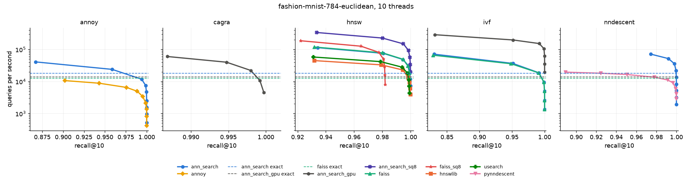
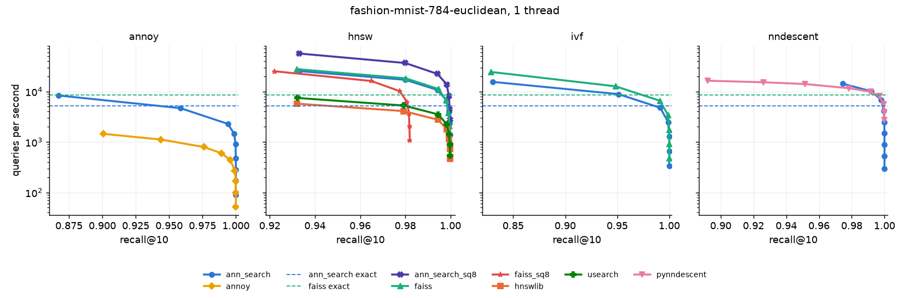
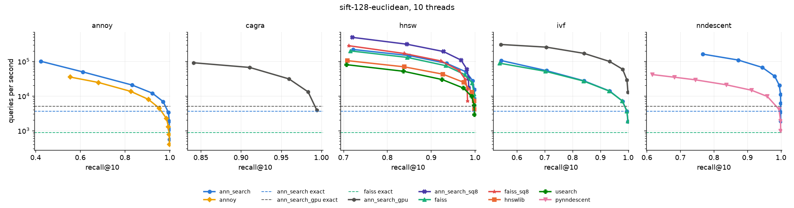
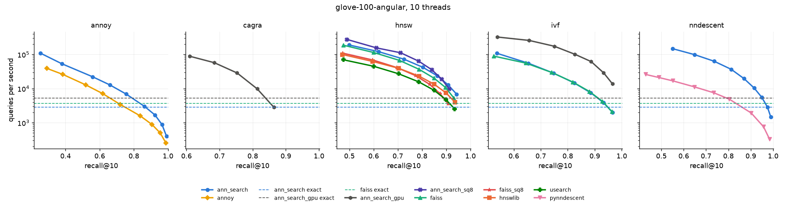

## Comparison against other libraries

How does ann-search stack up against what people reach for in Python? We run
the [ann-benchmarks](https://ann-benchmarks.com) protocol on three of its
datasets and compare every library at **equal recall**, not at equal settings.
Two libraries with the same `ef_search` land at different recall, so "faster at
the same parameters" says little. Each library builds once, its search knob is
swept, and the tables give the best queries per second (QPS) it reaches at
recall@10 of 0.90, 0.95 and 0.99. GloVe is hard enough that most indices
never reach 0.95 there, so its targets are 0.70, 0.80 and 0.90.

Run via the Python bindings (from `benchmarks/`):

```bash
uv run bench.py run --dataset fashion-mnist-784-euclidean --threads 10
uv run bench.py run --dataset fashion-mnist-784-euclidean --threads 1
uv run bench.py run --dataset sift-128-euclidean --threads 10
uv run bench.py run --dataset glove-100-angular --threads 10
uv run bench.py summarise
```

### Setup

- **Datasets:** Fashion-MNIST (60,000 x 784, Euclidean), SIFT (1,000,000 x
  128, Euclidean) and GloVe (1,183,514 x 100, cosine). 10,000 held-out queries
  each, k = 10, ground truth from the HDF5 files. Recall is the overlap of
  neighbour ids.
- **Matched builds:** HNSW at M = 16 and ef_construction = 200 (ann-search,
  hnswlib, faiss `IndexHNSWFlat`, usearch at `f32`); the same graph on uniform
  8-bit codes (ann-search `HnswSq8uIndex`, faiss `IndexHNSWSQ` with
  `QT_8bit_uniform`), both building on the codes; Annoy at 50 trees (ann-search, annoy);
  NN-Descent graphs of degree 30 (ann-search, pynndescent); IVF at
  `nlist = sqrt(n)` (ann-search, faiss `IndexIVFFlat`), each with its own
  default training: 30 k-means iterations here, 10 in faiss, which is most of
  the gap in IVF build time; exact search as the baseline (ann-search, faiss `IndexFlat`).
- **Swept at query time:** `ef_search` 10 to 640 (NN-Descent to 2,560);
  Annoy `search_k` 500 to 250,000; `nprobe` 2 to 128; pynndescent `epsilon`
  0 to 0.5; CAGRA `beam_width` 16 to 256.
- **Timing:** one build, then per sweep point an untimed 100-query warm-up and
  the median of three timed calls over all 10,000 queries. pynndescent's
  `prepare()` counts towards its build, and its numba JIT is warmed beforehand.
- **Memory:** every library and method runs in its own process, measured as
  the kernel's `phys_footprint` (what Activity Monitor shows; RSS on Linux).
  *Build peak* is the peak above the baseline before the training data was
  loaded, so it includes the input data. *Index* is what stays once the
  caller's copy of the data is freed: an index that copies the vectors and one
  that keeps a reference both count them once. Freed memory the allocator
  holds on to still counts, as it does for any process that built the index.
- **Threads:** pinned through each library's own argument plus
  `OMP_NUM_THREADS`, `NUMBA_NUM_THREADS` and friends. annoy's Python API
  queries one vector at a time, so its multi-threaded rows split the queries
  over a thread pool.

### Caveats

- The bindings build with the `accelerate` feature, so on macOS exact search
  runs through Apple Accelerate. The other docs here run on faer.
- `ann_search_gpu` rows are the wgpu indices (exhaustive, IVF, CAGRA) on the
  M1 Max's integrated GPU. Not apples to apples: they sit next to CPU
  libraries because wgpu runs on Metal, Vulkan and DX12, so no NVIDIA card is
  needed. Thread counts don't apply to them, so the 1-thread run leaves them
  out. Memory is unified here, so their footprint includes the device
  buffers.
- Builds are a single run each. Read small gaps as ties.
- "Best QPS at or above a target" depends on where the sweep grid steps fall.
  A library whose grid point lands at 0.909 counts at 0.90; one that lands at
  0.896 has to take the next, much slower, point. The figures show the whole
  curve; check them before quoting a ratio from the tables.
- Fashion-MNIST and SIFT hold integers from 0 to 255, so uniform 8-bit codes
  are close to lossless on them and the SQ8 rows look better than they will on
  real embeddings. GloVe is the honest test.

## Table of Contents

- [Fashion-MNIST, 10 threads](#fashion-mnist-10-threads)
- [Fashion-MNIST, 1 thread](#fashion-mnist-1-thread)
- [SIFT, 10 threads](#sift-10-threads)
- [GloVe, 10 threads](#glove-10-threads)

### Fashion-MNIST, 10 threads



| Method | Library | Build (s) | Build peak (MiB) | Index (MiB) | QPS @ 0.90 | QPS @ 0.95 | QPS @ 0.99 |
|---|---|---:|---:|---:|---:|---:|---:|
| annoy | **ann_search** | 1.6 | 905 | 547 | 23,900 | 23,900 | 11,787 |
| annoy | annoy | 4.4 | 435 | 238 | 10,657 | 6,523 | 3,376 |
| cagra | **ann_search_gpu** | 8.6 | 2,290 | 1,690 | 60,202 | 60,202 | 40,005 |
| exhaustive | **ann_search** | 0.0 | 402 | 223 | 17,988 | 17,988 | 17,988 |
| exhaustive | **ann_search_gpu** | 0.0 | 584 | 225 | 13,964 | 13,964 | 13,964 |
| exhaustive | faiss | 0.0 | 359 | 180 | 12,769 | 12,769 | 12,769 |
| hnsw | **ann_search_sq8** | 1.4 | 587 | 58 | 338,286 | 227,144 | 149,588 |
| hnsw | faiss_sq8 | 3.2 | 234 | 54 | 187,017 | 126,388 | n/a |
| hnsw | faiss | 3.6 | 369 | 189 | 119,029 | 78,431 | 49,341 |
| hnsw | **ann_search** | 3.4 | 414 | 234 | 113,957 | 75,699 | 48,528 |
| hnsw | usearch | 6.5 | 376 | 196 | 58,030 | 41,721 | 27,996 |
| hnsw | hnswlib | 8.3 | 381 | 202 | 44,841 | 33,074 | 22,809 |
| ivf | **ann_search_gpu** | 1.4 | 2,166 | 1,449 | 198,148 | 198,148 | 153,022 |
| ivf | **ann_search** | 1.2 | 761 | 223 | 36,642 | 36,642 | 18,662 |
| ivf | faiss | 0.5 | 424 | 243 | 35,808 | 18,615 | 18,615 |
| nndescent | **ann_search** | 3.4 | 1,065 | 506 | 71,451 | 71,451 | 51,848 |
| nndescent | pynndescent | 3.0 | 409 | 215 | 18,114 | 16,492 | 11,133 |

### Fashion-MNIST, 1 thread

The ann-benchmarks convention.



| Method | Library | Build (s) | Build peak (MiB) | Index (MiB) | QPS @ 0.90 | QPS @ 0.95 | QPS @ 0.99 |
|---|---|---:|---:|---:|---:|---:|---:|
| annoy | **ann_search** | 5.6 | 802 | 443 | 4,677 | 4,677 | 2,286 |
| annoy | annoy | 17.8 | 427 | 246 | 1,450 | 793 | 437 |
| exhaustive | faiss | 0.0 | 360 | 180 | 8,632 | 8,632 | 8,632 |
| exhaustive | **ann_search** | 0.0 | 404 | 224 | 5,171 | 5,171 | 5,171 |
| hnsw | **ann_search_sq8** | 9.1 | 584 | 54 | 56,523 | 36,671 | 22,304 |
| hnsw | faiss | 16.3 | 369 | 190 | 27,727 | 18,238 | 11,219 |
| hnsw | **ann_search** | 16.6 | 414 | 235 | 25,362 | 17,045 | 10,735 |
| hnsw | faiss_sq8 | 19.5 | 233 | 53 | 25,163 | 16,168 | n/a |
| hnsw | usearch | 52.3 | 374 | 195 | 7,448 | 5,273 | 3,515 |
| hnsw | hnswlib | 66.8 | 375 | 195 | 5,740 | 4,093 | 2,752 |
| ivf | faiss | 0.6 | 444 | 265 | 12,671 | 6,567 | 6,567 |
| ivf | **ann_search** | 1.9 | 763 | 224 | 8,861 | 8,861 | 4,758 |
| nndescent | pynndescent | 12.9 | 361 | 184 | 15,236 | 14,060 | 9,900 |
| nndescent | **ann_search** | 16.5 | 1,072 | 444 | 14,277 | 14,277 | 10,102 |

### SIFT, 10 threads



| Method | Library | Build (s) | Build peak (MiB) | Index (MiB) | QPS @ 0.90 | QPS @ 0.95 | QPS @ 0.99 |
|---|---|---:|---:|---:|---:|---:|---:|
| annoy | **ann_search** | 8.0 | 2,433 | 1,137 | 12,019 | 6,873 | 3,306 |
| annoy | annoy | 19.3 | 1,792 | 1,240 | 7,959 | 4,456 | 1,284 |
| cagra | **ann_search_gpu** | 21.7 | 10,337 | 9,361 | 66,477 | 30,949 | 3,852 |
| exhaustive | **ann_search_gpu** | 0.1 | 1,465 | 488 | 4,958 | 4,958 | 4,958 |
| exhaustive | **ann_search** | 0.1 | 978 | 490 | 3,648 | 3,648 | 3,648 |
| exhaustive | faiss | 0.1 | 978 | 489 | 864 | 864 | 864 |
| hnsw | **ann_search_sq8** | 22.9 | 1,038 | 195 | 191,845 | 108,377 | n/a |
| hnsw | faiss_sq8 | 45.0 | 773 | 281 | 102,191 | 54,414 | n/a |
| hnsw | **ann_search** | 43.9 | 1,136 | 636 | 86,835 | 49,210 | 27,349 |
| hnsw | faiss | 51.1 | 1,143 | 640 | 74,621 | 40,739 | 23,708 |
| hnsw | hnswlib | 84.6 | 1,256 | 768 | 42,436 | 24,582 | 12,691 |
| hnsw | usearch | 111.5 | 1,229 | 725 | 29,667 | 16,799 | 9,594 |
| ivf | **ann_search_gpu** | 2.9 | 4,033 | 1,600 | 98,749 | 59,046 | 28,676 |
| ivf | **ann_search** | 1.7 | 1,485 | 493 | 13,778 | 7,039 | 3,593 |
| ivf | faiss | 8.7 | 1,170 | 682 | 13,734 | 7,158 | 3,609 |
| nndescent | **ann_search** | 27.4 | 3,582 | 1,388 | 66,570 | 37,006 | 20,227 |
| nndescent | pynndescent | 26.6 | 1,487 | 814 | 14,586 | 9,617 | 4,104 |

### GloVe, 10 threads



| Method | Library | Build (s) | Build peak (MiB) | Index (MiB) | QPS @ 0.70 | QPS @ 0.80 | QPS @ 0.90 |
|---|---|---:|---:|---:|---:|---:|---:|
| annoy | **ann_search** | 11.5 | 2,389 | 1,143 | 6,928 | 2,999 | 1,681 |
| annoy | annoy | 24.8 | 2,127 | 1,608 | 3,445 | 1,588 | 886 |
| cagra | **ann_search_gpu** | 25.1 | 10,201 | 9,298 | 28,637 | 9,820 | n/a |
| exhaustive | **ann_search_gpu** | 0.1 | 1,360 | 457 | 5,218 | 5,218 | 5,218 |
| exhaustive | faiss | 0.3 | 913 | 453 | 3,725 | 3,725 | 3,725 |
| exhaustive | **ann_search** | 0.1 | 909 | 457 | 2,889 | 2,889 | 2,889 |
| hnsw | **ann_search_sq8** | 52.0 | 1,412 | 229 | 111,992 | 35,319 | 9,784 |
| hnsw | **ann_search** | 71.3 | 1,090 | 638 | 72,807 | 42,061 | 12,818 |
| hnsw | faiss | 68.1 | 1,100 | 642 | 66,954 | 20,110 | 5,259 |
| hnsw | hnswlib | 111.5 | 1,231 | 779 | 39,380 | 13,468 | 3,998 |
| hnsw | usearch | 155.6 | 1,243 | 792 | 27,202 | 8,882 | 2,530 |
| hnsw | faiss_sq8 | 116.2 | 913 | 302 | 23,973 | 13,318 | 3,596 |
| ivf | **ann_search_gpu** | 2.4 | 3,828 | 1,579 | 174,133 | 101,204 | 29,008 |
| ivf | faiss | 6.3 | 1,080 | 628 | 29,608 | 15,492 | 4,197 |
| ivf | **ann_search** | 1.7 | 1,383 | 475 | 28,154 | 14,567 | 3,891 |
| nndescent | **ann_search** | 39.3 | 3,651 | 1,357 | 63,062 | 36,625 | 10,440 |
| nndescent | pynndescent | 46.7 | 1,625 | 809 | 7,547 | 4,887 | 1,921 |

---

### Runtime info

*ann-search-rs 0.10.1 (commit v0.10.1-17-g0393802-dirty), run on 2026-10-09 on Apple M1 Max.*
*All benchmarks were run on M1 Max MacBook Pro with 64 GB unified memory.*
